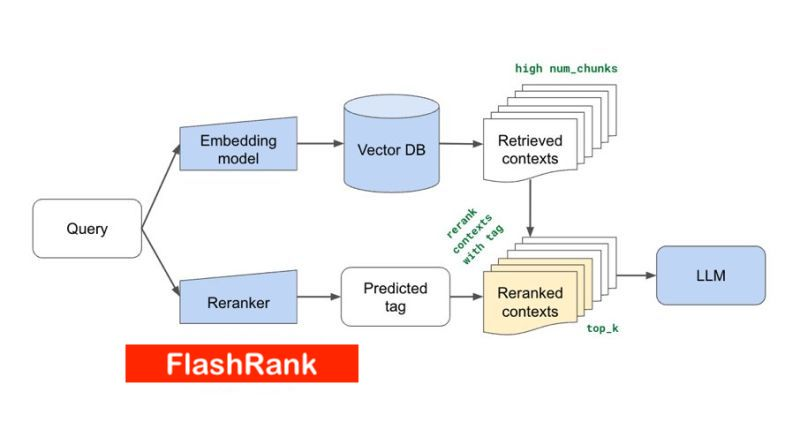

# FlashRank
Ultra-lite &amp; Super-fast SoTA cross-encoder based re-ranking for your search &amp; retrieval pipelines.

#### Ultra-lite:
- No torch or transformers dependency
- **Smallest model** is **~17MB**
- **Largest model** is  **~130MB**
- Total package is < 200MB
- Best for serverless deployemnts like AWS Lambda.
    
#### Super-fast:
- Runs on CPU
- Rerank speed is a function of # of tokens in passages, query + model depth (layers)
- To give an idea, Time taken by the example in code using the default model is below.
<center></center>
- Detailed benchmarking TBD

#### SoTA Cross-encoders:
- Below are the list of models supported as now.
    * ms-marco-TinyBERT-L-2-v2 (default)
    * ms-marco-MiniLM-L-12-v2
- Why only sleeker models? Reranking is the final leg of larger retrieval pipelines, idea is to avoid any extra overhead especially for user-facing scenarios. To that end models with really small footprint that doesn't need any specialised hardware and yet offer great performance are chosen. Feel free to raise PRs for new models as you see fit.

## Where can you use it?
  - Lexical Search (RegularDBs that supported full-text search or Inverted Index)
  <center></center>
  - Semantic Search (VectorDBs)
  <center></center>
  - Hybrid Search


## Installation:
```python 
pip install flashrank
```

## Usage:
```python
from flashrank.Ranker import Ranker
# for default blazing fast model and competitive performance.
ranker = Ranker()

or 
# for a slower deeper model for a slightly better performance.
ranker = Ranker(model_name="ms-marco-MiniLM-L-12-v2", cache_dir="/opt")
```

```python
query = "Tricks to accelerate LLM inference"
passages = [
    "Introduce *lookahead decoding*: - a parallel decoding algo to accelerate LLM inference - w/o the need for a draft model or a data store - linearly decreases # decoding steps relative to log(FLOPs) used per decoding step.",
    "LLM inference efficiency will be one of the most crucial topics for both industry and academia, simply because the more efficient you are, the more $$$ you will save. vllm project is a must-read for this direction, and now they have just released the paper",
    "There are many ways to increase LLM inference throughput (tokens/second) and decrease memory footprint, sometimes at the same time. Here are a few methods I’ve found effective when working with Llama 2. These methods are all well-integrated with Hugging Face.  This list is far from exhaustive; some of these techniques can be used in combination with each other and there are plenty of others to try. - Bettertransformer (Optimum Library): Simply call `model.to_bettertransformer()` on your Hugging Face model for a modest improvement in tokens per second.  - Fp4 Mixed-Precision (Bitsandbytes): Requires minimal configuration and dramatically reduces the model's memory footprint.  - AutoGPTQ: Time-consuming but leads to a much smaller model and faster inference. The quantization is a one-time cost that pays off in the long run. ",
    "Ever want to make your LLM inference go brrrrr but got stuck at implementing speculative decoding and finding the suitable draft model? No more pain! Thrilled to unveil Medusa, a simple framework that removes the annoying draft model while getting 2x speedup. ",
    "vLLM is a fast and easy-to-use library for LLM inference and serving. vLLM is fast with: State-of-the-art serving throughput Efficient management of attention key and value memory with PagedAttention Continuous batching of incoming requests Optimized CUDA kernels"
]
results = ranker.rerank(query, passages)
print(results)

```

```python 
[{'score': 6.2437506, 'passage': 'Introduce *lookahead decoding*: - a parallel decoding algo to accelerate LLM inference - w/o the need for a draft model or a data store - linearly decreases # decoding steps relative to log(FLOPs) used per decoding step.'}, 
{'score': 3.1694593, 'passage': "There are many ways to increase LLM inference throughput (tokens/second) and decrease memory footprint, sometimes at the same time. Here are a few methods I’ve found effective when working with Llama 2. These methods are all well-integrated with Hugging Face.  This list is far from exhaustive; some of these techniques can be used in combination with each other and there are plenty of others to try. - Bettertransformer (Optimum Library): Simply call `model.to_bettertransformer()` on your Hugging Face model for a modest improvement in tokens per second.  - Fp4 Mixed-Precision (Bitsandbytes): Requires minimal configuration and dramatically reduces the model's memory footprint.  - AutoGPTQ: Time-consuming but leads to a much smaller model and faster inference. The quantization is a one-time cost that pays off in the long run. "}, 
{'score': 0.49264988, 'passage': 'vLLM is a fast and easy-to-use library for LLM inference and serving. vLLM is fast with: State-of-the-art serving throughput Efficient management of attention key and value memory with PagedAttention Continuous batching of incoming requests Optimized CUDA kernels'}, 
{'score': 0.24710579, 'passage': 'LLM inference efficiency will be one of the most crucial topics for both industry and academia, simply because the more efficient you are, the more $$$ you will save. vllm project is a must-read for this direction, and now they have just released the paper'}, 
{'score': -2.2156813, 'passage': 'Ever want to make your LLM inference go brrrrr but got stuck at implementing speculative decoding and finding the suitable draft model? No more pain! Thrilled to unveil Medusa, a simple framework that removes the annoying draft model while getting 2x speedup. '}]
```

## Deployment patterns
TBD