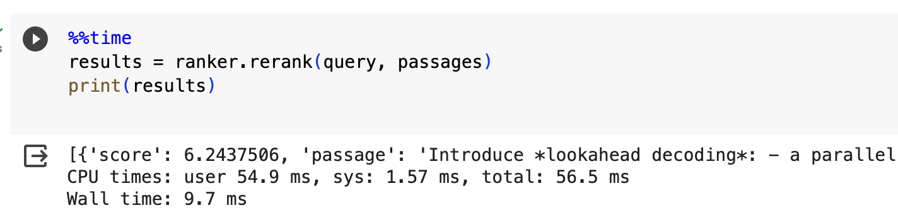
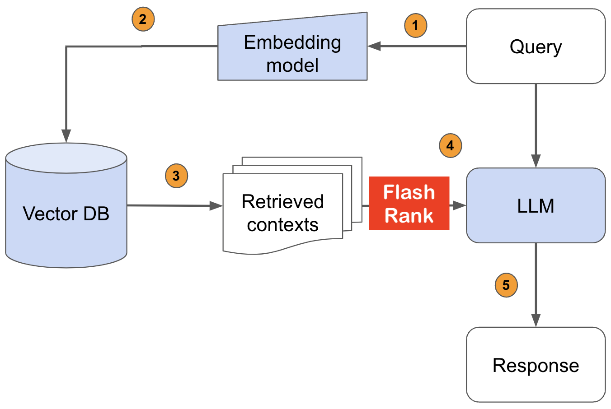
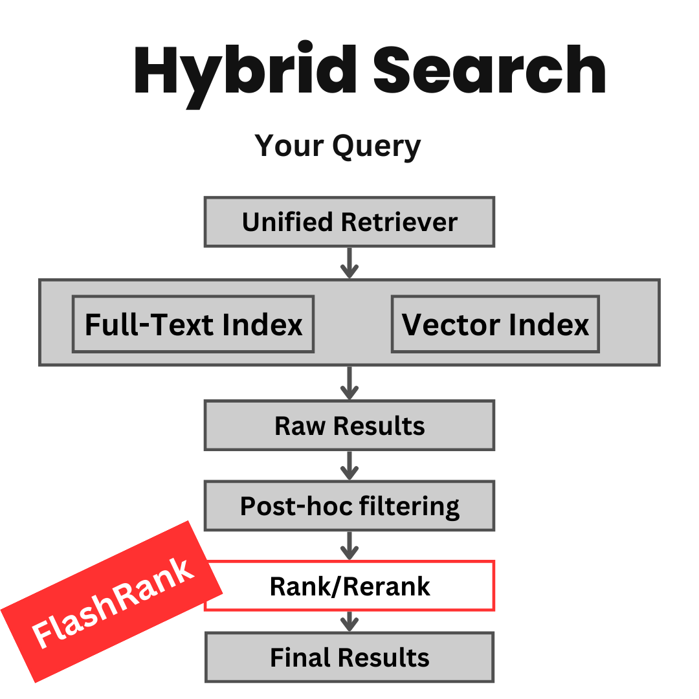

# 🏎️ FlashRank
Ultra-lite &amp; Super-fast Python library to add re-ranking to your existing search &amp; retrieval pipelines. It is based on SoTA cross-encoders.

1. ⚡ **Ultra-lite**: 
    - **No Torch or Transformers** needed. Runs on CPU.
    - Boasts the **tiniest reranking model in the world, ~4MB**.
    
2. ⏱️ **Super-fast**:
    - Rerank speed is a function of **# of tokens in passages, query + model depth (layers)**
    - To give an idea, Time taken by the example (in code) using the default model is below.
    - <center></center>
    - Detailed benchmarking, TBD

3. 💸 **$ concious**:
    - **Lowest $ per invocation:** Serverless deployments like Lambda are charged by memory & time per invocation*
    - **Smaller package size** = shorter cold start times, quicker re-deployments for Serverless.

4. 🎯 **Based on SoTA Cross-encoders**:
    - Below are the list of models supported as of now.
        * ms-marco-TinyBERT-L-2-v2 (default)
        * ms-marco-MiniLM-L-12-v2
        * rank-T5-flan (Best non cross-encoder reranker)
        * ms-marco-MultiBERT-L-12  (Multi-lingual, [supports 100+ languages](https://github.com/google-research/bert/blob/master/multilingual.md#list-of-languages))

    - Why only sleeker models? Reranking is the final leg of larger retrieval pipelines, idea is to avoid any extra overhead especially for user-facing scenarios. To that end models with really small footprint that doesn't need any specialised hardware and yet offer competitive performance are chosen. Feel free to raise issues to add support for a new models as you see fit.


## 🚀 Installation:
```python 
pip install flashrank
```

## Usage:
```python
from flashrank.Ranker import Ranker
# Nano (~4MB), blazing fast model & competitive performance (ranking precision).
ranker = Ranker()

or 

# Small (~34MB), slightly slower & best performance (ranking precision).
ranker = Ranker(model_name="ms-marco-MiniLM-L-12-v2", cache_dir="/opt")

or 

# Medium (~110MB), slower model with best zeroshot performance (ranking precision) on out of domain data.
ranker = Ranker(model_name="rank-T5-flan", cache_dir="/opt")

or 

# Medium (~150MB), slower model with competitive performance (ranking precision) for 100+ languages  (don't use for english)
ranker = Ranker(model_name="ms-marco-MultiBERT-L-12", cache_dir="/opt")
```

```python
query = "How to speedup LLMs?"
# You could your internal passage record ids or simple numeric indices.
passages = [
    {"id": 1, "text": "Introduce *lookahead decoding*: - a parallel decoding algo to accelerate LLM inference - w/o the need for a draft model or a data store - linearly decreases # decoding steps relative to log(FLOPs) used per decoding step."},
    {"id": 2, "text": "LLM inference efficiency will be one of the most crucial topics for both industry and academia, simply because the more efficient you are, the more $$$ you will save. vllm project is a must-read for this direction, and now they have just released the paper"},
    {"id": 3, "text": "There are many ways to increase LLM inference throughput (tokens/second) and decrease memory footprint, sometimes at the same time. Here are a few methods I’ve found effective when working with Llama 2. These methods are all well-integrated with Hugging Face. This list is far from exhaustive; some of these techniques can be used in combination with each other and there are plenty of others to try. - Bettertransformer (Optimum Library): Simply call `model.to_bettertransformer()` on your Hugging Face model for a modest improvement in tokens per second. - Fp4 Mixed-Precision (Bitsandbytes): Requires minimal configuration and dramatically reduces the model's memory footprint. - AutoGPTQ: Time-consuming but leads to a much smaller model and faster inference. The quantization is a one-time cost that pays off in the long run."},
    {"id": 4, "text": "Ever want to make your LLM inference go brrrrr but got stuck at implementing speculative decoding and finding the suitable draft model? No more pain! Thrilled to unveil Medusa, a simple framework that removes the annoying draft model while getting 2x speedup."},
    {"id": 5, "text": "vLLM is a fast and easy-to-use library for LLM inference and serving. vLLM is fast with: State-of-the-art serving throughput Efficient management of attention key and value memory with PagedAttention Continuous batching of incoming requests Optimized CUDA kernels"}
]

results = ranker.rerank(query, passages)
print(results)

```

```python 
# o/p from default reranker
[
  {'id': 4, 'score': 0.018163264, 'passage': 'Ever want to make your LLM inference go brrrrr but got stuck at implementing speculative decoding and finding the suitable draft model? No more pain! Thrilled to unveil Medusa, a simple framework that removes the annoying draft model while getting 2x speedup.'}
  {'id': 5, 'score': 0.013987866, 'passage': 'vLLM is a fast and easy-to-use library for LLM inference and serving. vLLM is fast with: State-of-the-art serving throughput Efficient management of attention key and value memory with PagedAttention Continuous batching of incoming requests Optimized CUDA kernels'}
  {'id': 3, 'score': 0.00091874925, 'passage': "There are many ways to increase LLM inference throughput (tokens/second) and decrease memory footprint, sometimes at the same time. Here are a few methods I’ve found effective when working with Llama 2. These methods are all well-integrated with Hugging Face. This list is far from exhaustive; some of these techniques can be used in combination with each other and there are plenty of others to try. - Bettertransformer (Optimum Library): Simply call `model.to_bettertransformer()` on your Hugging Face model for a modest improvement in tokens per second. - Fp4 Mixed-Precision (Bitsandbytes): Requires minimal configuration and dramatically reduces the model's memory footprint. - AutoGPTQ: Time-consuming but leads to a much smaller model and faster inference. The quantization is a one-time cost that pays off in the long run."}
  {'id': 1, 'score': 0.00076141005, 'passage': 'Introduce *lookahead decoding*: - a parallel decoding algo to accelerate LLM inference - w/o the need for a draft model or a data store - linearly decreases # decoding steps relative to log(FLOPs) used per decoding step.'}
  {'id': 2, 'score': 0.0002851765, 'passage': 'LLM inference efficiency will be one of the most crucial topics for both industry and academia, simply because the more efficient you are, the more $$$ you will save. vllm project is a must-read for this direction, and now they have just released the paper'}

]
```

## You can use it with any search & retrieval pipeline:

1. **Lexical Search (RegularDBs that supports full-text search or Inverted Index)**
  <center></center>

<br/>

2. **Semantic Search / RAG usecases (VectorDBs)**
  <center></center>
<br/>

3. **Hybrid Search**
  <center></center>

<br/>

## Deployment patterns
#### How to use it in a AWS Lambda function ?
In AWS or other serverless environments the entire VM is read-only you might have to create your 
own custom dir. You can do so in your Dockerfile and use it for loading the models (and eventually as a cache between warm calls). You can do it during init with cache_dir parameter. 

```python
ranker = Ranker(model_name="ms-marco-MiniLM-L-12-v2", cache_dir="/opt")
```